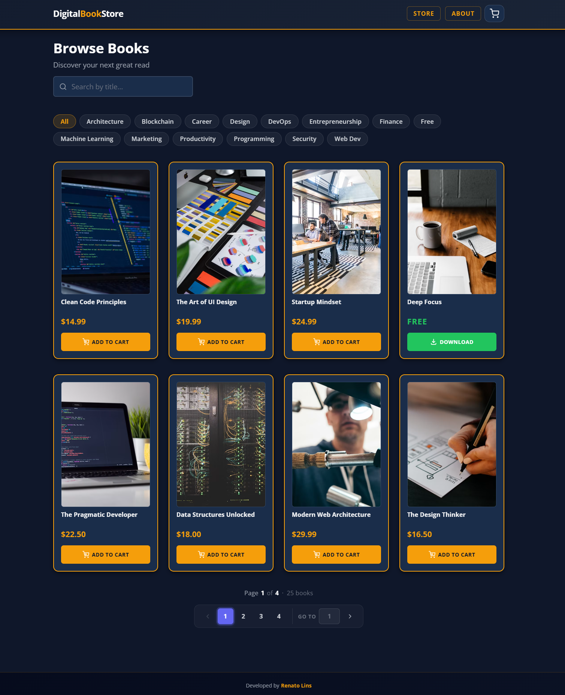

# DigitalBookStore

An Open-Source Angular SPA built as a portfolio project for exploring modern frontend development. This standalone application allows users to browse and simulate the purchase of digital books. It uses Angular Signals for state management and Sass (SCSS) for styling, with features including a landing page with a free-books shelf, a paginated and filterable book catalog with a details page, a shopping cart, and a mocked checkout with an instant-download purchase flow. The project also implements lazy-loaded routes and a design token system based on CSS variables.

## Prints


---


---


---


## Development Quick Start

```bash
npm install                      # Install dependencies (also installs git hooks via husky)
npm run dev                      # Start the dev server at http://localhost:4200
```

## Main Stack

- **TypeScript** - Type-safe JavaScript
- **Angular** - Component framework (v22)
- **Angular Signals** - Fine-grained reactive state (no NgRx)
- **Angular Router** - Client-side routing with lazy loading
- **SCSS** - Pure CSS preprocessor with design tokens

## Tools & Libraries

- **Angular CLI** - Project scaffolding, build, and dev server
- **HttpClient** - HTTP requests to static JSON data
- **Sass** - CSS preprocessor with BEM naming conventions
- **Vitest** - Unit testing (Angular CLI default via `@angular/build:unit-test`)
- **ESLint** - Static analysis with `@angular-eslint`, `typescript-eslint`, and `eslint-plugin-prettier`
- **Prettier** - Opinionated code formatter (enforced as ESLint errors, LF line endings)
- **Husky** - Git hook manager (`pre-commit` runs lint-staged automatically)
- **lint-staged** - Runs ESLint + Prettier only on staged files before each commit
- **canvas-confetti** - Confetti burst animation on the purchase success screen

### Prerequisites

- Node.js `^22.22.3 || ^24.15.0 || >=26.0.0` (required by Angular 22)

The Angular CLI ships as a local devDependency: no global install needed.
`npm install` provides it, and the npm scripts above (or `npx ng`) run it.
If `ng` is "not recognized", dependencies simply haven't been installed yet.

## Documentation

For complete documentation, see the `docs/` folder which includes:

- [Architecture](docs/architecture.md) - Overall project structure and data flow
- [State Management](docs/state-management.md) - Signals and service-based state
- [Styling](docs/styling.md) - SCSS conventions and design tokens
- [Visual Design](docs/visual-design.md) - Color rationale, typography, and UI decisions
- [Components](docs/components.md) - Component reference and inputs
- [Angular Practices](docs/angular-practices.md) - Best practices applied

## Technical Implementations of This Project

- ✅ Standalone components: no `NgModule` anywhere in the codebase
- ✅ Signal-based state with `signal()`, `computed()`, and injectable services
- ✅ Lazy-loaded routes via `loadComponent` for optimal bundle splitting
- ✅ Modern `@if` / `@for` built-in control flow (no `*ngIf` / `*ngFor`)
- ✅ `input()` signal API replacing `@Input()` decorators
- ✅ `inject()` function replacing constructor parameter injection
- ✅ `InjectionToken` for app-wide configuration flags (`src/app/app.tokens.ts`)
- ✅ `domain/` and `shared/` layers separating services, components, and models from page-level code
- ✅ Design tokens as CSS custom properties in a single `_variables.scss` partial
- ✅ BEM-style SCSS with `&__` / `&--` nesting
- ✅ Self-hosted Open Sans font family via `@font-face`
- ✅ Responsive layout driven by a `ResponsiveService` with named breakpoints
- ✅ Strict TypeScript with `strictTemplates` Angular compiler option
- ✅ Unit tests for all components (Vitest via `@angular/build:unit-test`, signal-backed mocks, co-located `.spec.ts` files)
- ✅ ESLint with `@angular-eslint` + `typescript-eslint` + Prettier integration
- ✅ Pre-commit hook via Husky that runs lint-staged (ESLint + Prettier on staged files only)
- ✅ `.gitattributes` enforcing LF line endings across the repository

## Features of This Project

- ✅ Landing page with animated book illustration, stats strip, and feature cards
- ✅ Featured free-books shelf on the landing page, downloadable instantly with no cart step
- ✅ Product catalogue loaded from a static JSON endpoint, paged in memory by `BooksApiService`
- ✅ Real-time search: filter books by title instantly (client-side, signal-powered)
- ✅ Category filter chips synced to a `category` query param, so filtered links are shareable
- ✅ Skeleton loading cards shown while a catalogue page is in flight
- ✅ Paginator with ellipsis-collapsed page numbers and a jump-to-page input
- ✅ Book details page with metadata chips, live cart quantity, and add-to-cart/download actions
- ✅ Shopping cart with add, subtract, set quantity, and remove actions
- ✅ Cart item badge on the header icon that shows live count, hidden when empty
- ✅ Zero-priced books download instantly from the store, details page, or home shelf, bypassing the cart
- ✅ Checkout modal with mocked PIX, PayPal, and Credit Card payment methods
- ✅ `UNIQUE_PURCHASE` mode: each title can only be purchased once per order (configurable via `InjectionToken`)
- ✅ `CURRENCY` mode: prices rendered in USD or BRL via `AppCurrencyPipe` (configurable via `InjectionToken`)
- ✅ Purchase flow that moves cart items to a download queue
- ✅ Toast notifications (success, error, info, warning) with position configurable via `position` input (`top` | `bottom`, default `top`)
- ✅ Per-item file download on the success page
- ✅ Confetti animation on the purchase success screen (`canvas-confetti`)
- ✅ Book cover placeholder SVG (620×800) shown on image load failure via `(error)` binding
- ✅ Shared `AppButtonComponent` with variants: `primary`, `outline`, `cta`, `download`, `ghost`
- ✅ Fully responsive layout across all viewport sizes, driven by a shared `ResponsiveService`
- ✅ 404 not-found page with navigation back to the store
- ✅ About page accessible from the header navigation
